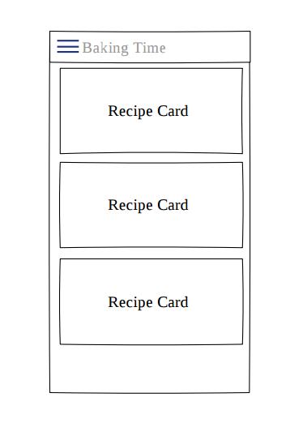
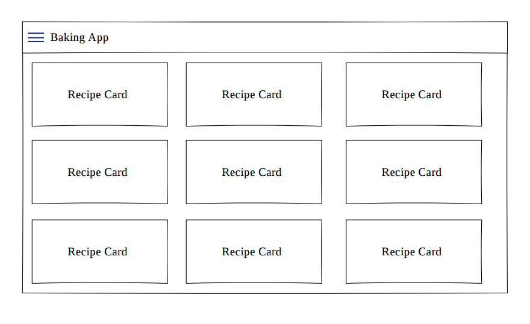
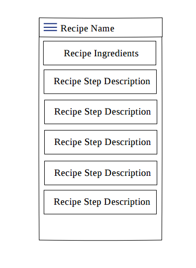
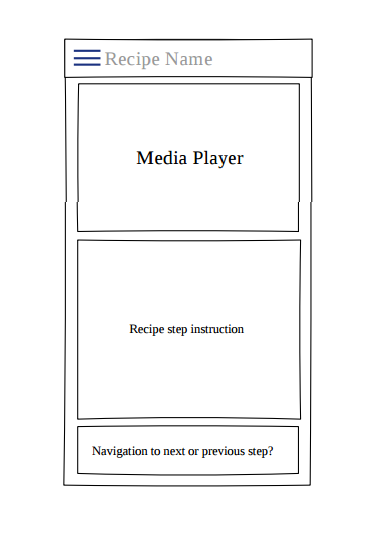
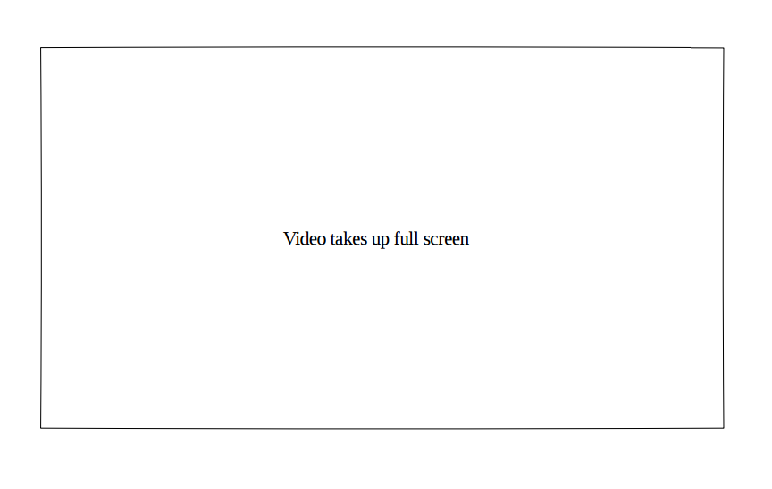
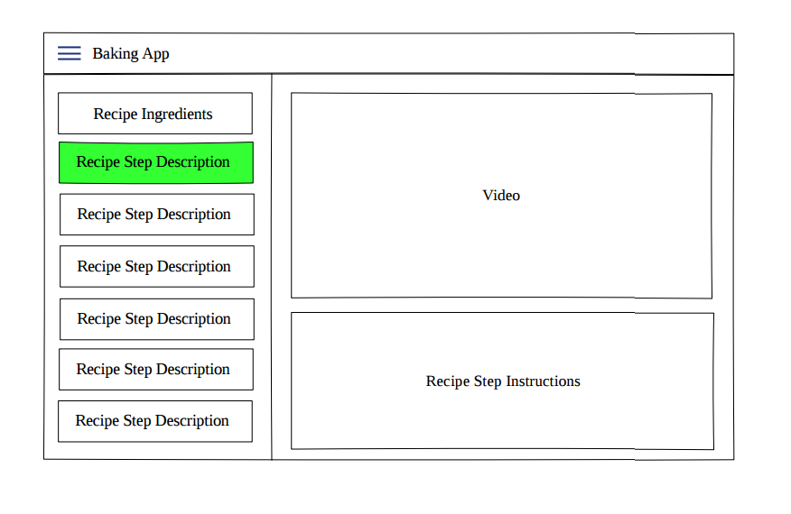

# What do I have to do in order to acomplish the Baking Recipes App?

## General App Usage

 - [ ] App should display recipes from provided [network resource](https://d17h27t6h515a5.cloudfront.net/topher/2017/May/59121517_baking/baking.json).
 - [ ] App should allow navigation between individual recipes and recipe steps.
 - [ ] App uses `RecyclerView` and can handle recipe steps that include videos or images.
 - [ ] App conforms to common standards found in the [Android Nanodegree General Project Guidelines](http://udacity.github.io/android-nanodegree-guidelines/core.html).

## Components and Libraries

 - [ ] Application uses Master Detail Flow to display recipe steps and navigation between them.
 - [ ] Application uses [Exoplayer](https://github.com/google/exoplayer) to display videos.
 - [ ] Application properly initializes and releases video assets when appropriate.
 - [ ] Application should properly retrieve media assets from the provided network links. It should properly handle network requests.
 - [ ] Application makes use of Espresso to test aspects of the UI.
 - [ ] Application sensibly utilizes a third-party library to enhance the app's features. That could be helper library to interface with ContentProviders if you choose to store the recipes, a UI binding library to avoid writing findViewById a bunch of times, or something similar.

## Homescreen Widget

 - [ ] Application has a companion homescreen widget.
 - [ ] Widget displays ingredient list for desired recipe.

## Available Mocks

### Mocks for phone

|Description | Mock image |
|:---------|:---------:|
|List of recipes on **phones** |  |
|List of recipes on **tablets** |  |
|Recipe details on **phones** |  |
|Recipe step details on **phones** |  |
|Fullscreen video of recipe step on **phones**|  |
|Recipe details with its steps on **tablets**|  |
